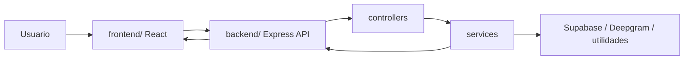

# BonoVoz

Aplicación web para atención y validación de beneficios mediante voz.

## Estructura

El proyecto quedó dividido en dos partes:

- `frontend/`: interfaz React + Vite + TypeScript.
- `backend/`: API Express + TypeScript para voz, autenticación y administración.

## Frontend

El frontend usa una organización por vistas y servicios, que es la forma más natural de trabajar con React sin forzar un MVC clásico:

- `src/pages`: pantallas y vistas
- `src/components`: componentes reutilizables
- `src/services`: consumo de API
- `src/contexts`, `src/hooks`, `src/routes`, `src/utils`: soporte transversal

### Ejecutar frontend

```bash
cd frontend
npm install
npm run dev
```

## Backend

El backend sí sigue una separación muy cercana a MVC:

- `src/routes`: define endpoints
- `src/controllers`: recibe requests y arma responses
- `src/services`: lógica de negocio y acceso a datos
- `src/utils`, `src/types`, `src/config`: soporte auxiliar

### Ejecutar backend

```bash
cd backend
npm install
npm run dev
```

## Flujo principal



## Nota

La estructura se mantuvo sin cambiar nombres internos ni rutas relativas del frontend, para no romper el build ni el enrutamiento existente.
